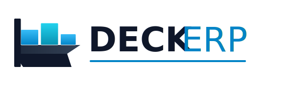

<div align="center">
  <a href="https://github.com/deryakmrt/DeckERP">
    
  </a>

  <h2>⚓ DECK ERP</h2>
  <p>
    <b>Modern, Cloud-Native Enterprise Resource Planning System</b>
  </p>
  
  <p>
    
    
    
    
    
    
  </p>

  <p>
    <a href="https://deck-erp.vercel.app" target="_blank"><strong>🚀 Canlı Demo → deck-erp.vercel.app</strong></a>
  </p>
  
  <br>
</div>

## Özellikler

- ✅ Ürün Yönetimi (Hammadde, Yarı Mamül, Mamül, Ticari Mal)
- ✅ Varyasyon & SKU Yönetimi
- ✅ BOM (Bill of Materials) Yönetimi
- ✅ Operasyon Rotaları (İşçilik & Makine)
- ✅ Müşteri (Cari) Yönetimi
- ✅ Satış Sipariş Yönetimi (Tekil & Parçalı Sevk)
- ✅ Çoklu Döviz Desteği (TRY, USD, EUR) + TCMB Anlık Kurlar
- ✅ Satır Bazlı Döviz Seçimi
- ✅ Kategori & Kriter Yönetimi
- ✅ Sipariş Durumları & İş Akışı
- ✅ Depo Yönetimi
- ✅ STF & ÜSTF PDF Çıktısı
- ✅ Clean Architecture
- ✅ RESTful API
- ✅ PostgreSQL veritabanı
- ✅ Docker containerization
- ✅ Swagger/OpenAPI

## Teknoloji Stack

- **Backend:** ASP.NET Core 8
- **Frontend:** React 18
- **Database:** PostgreSQL 16
- **ORM:** Entity Framework Core
- **Containerization:** Docker
- **Backend Hosting:** Railway
- **Frontend Hosting:** Vercel
- **Döviz API:** TCMB

## Canlı Deployment

| Servis | Platform | URL |
|--------|----------|-----|
| Frontend | Vercel | https://deck-erp.vercel.app |
| Backend API | Railway | https://deckerp-production.up.railway.app |
| Veritabanı | Railway PostgreSQL | - |

## Local Kurulum

### Gereksinimler
- .NET 8 SDK
- Docker Desktop
- Node.js 18+
- Git

### Çalıştırma

1. Repository'yi klonla:
```bash
git clone https://github.com/deryakmrt/DeckERP.git
cd DeckERP
```

2. Docker servisleri başlat:
```bash
docker-compose up -d
```

3. Frontend'i başlat:
```bash
cd client
npm install
npm start
```

Frontend: http://localhost:3000
API: http://localhost:5286
Swagger: http://localhost:5286/swagger

## Mimari
```
DeckERP/
├── client/                  → React Frontend
│   └── src/
│       ├── pages/           → Sayfalar
│       ├── services/        → API Servisleri
│       └── utils/           → Yardımcı Fonksiyonlar
├── src/
│   ├── ErpSystem.Api        → Controllers, Middleware
│   ├── ErpSystem.Application → Business Logic, Services
│   ├── ErpSystem.Domain     → Entities, Interfaces
│   └── ErpSystem.Infrastructure → Database, External APIs
└── docker-compose.yml
```

## Roadmap

- [x] Proje yapısı & Clean Architecture
- [x] PostgreSQL & Docker setup
- [x] Ürün Yönetimi (4 tip, varyasyon, SKU)
- [x] BOM & Operasyon Rotaları
- [x] Müşteri Yönetimi
- [x] Satış Sipariş Yönetimi
- [x] Çoklu Döviz & TCMB Entegrasyonu
- [x] PDF Çıktısı (STF & ÜSTF)
- [x] Railway + Vercel Cloud Deployment
- [ ] Authentication & Authorization
- [ ] Stok Hareketleri & Raporlama
- [ ] Üretim Takibi
- [ ] CI/CD Pipeline

---
